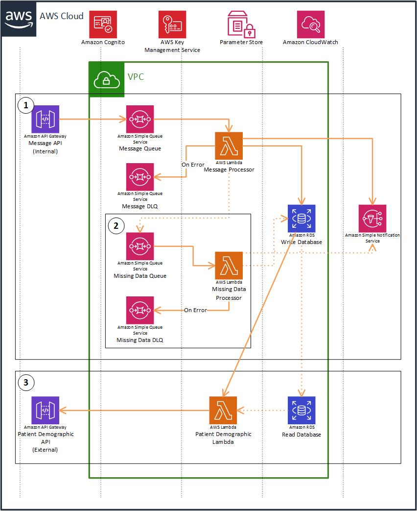

# Patient-Demographic-Service
The Patient Demographic Service is the regional source of truth for Patient Demographic Details thorough out the Midland region. The Patient Details Service encapsulates all software, infrastructure/network, data, configurations and processes required to operate the Patient Details as an autonomous service. The Patient Details Service may change over time as more detail is understood regarding the Patient Domain Model. However the service interfaces will remain stable, API version changes siginify any major changes to the service interface specification.  

# How to deploy?
1. Patient-Demographic-Service repository uses GitHub Actions for CI/CD automation.
2. CI/CD automation provisions AWS resources by using CloudFormation templates from cloudformation folder as well as deploy code to the AWS lambda.
3. Create S3 bucket _mhip-patient-demographic-service-&lt;environment-name&gt;_. Bucket to upload artifacts.
4. Create/Update GitHub secrets parameters - Required by CI/CD pipeline
    1. &lt;environment-name&gt;_AWS_ACCESS_KEY
    2. &lt;environment-name&gt;_AWS_SECRET_KEY
    3. &lt;environment-name&gt;_AWS_SESSION_TOKEN
    4. &lt;environment-name&gt;_AWS_CFN_EXECUTION_ROLE
5. Create/Update Parameter store
    1. /PatientDemographicService/&lt;environment&gt;/CloudFormation/KMS-Master-KeyIdARN 
    2. /PatientDemographicService/&lt;environment-name&gt;/CloudFormation/Lambda-Security-GroupIds
    3. /PatientDemographicService/&lt;environment-name&gt;/CloudFormation/Lambda-SubnetIds
6. CI/CD pipeline is setup as 
    When code is pushed to the feature branch, it will deploy to the sandbox environment
    When feature branch is merged with dev branch, it will deploy to the dev environment
    When dev branch is merged with test branch, it will deploy to the test environment
    When test branch is merged with main branch, it will deploy to the prod environment.

##### Create RDS
1. Update parameters in _rds-cfn.yml_.
2. Create CloudFormation stack with _rds-cfn.yml_ file manually. This will create  DB Instance in AWS RDS.
3. Connect to the DB Instance using SSMS 
4. Create database. For example; PatientDemographicService.App
5. Run all sql scripts from sql folder sequentially
    1. table-script.sql
    2. seed-script.sql
    3. country-script.sql
    4. domicile-script.sql
    4. additional-seed-to-include-dhb-code-script.sql

## AWS Design
The CloudFormation provisions resources as follows:
  

# Application Settings to run Patient-Demographic-Service
1. All application settings parameters are stored in AWS Parameter Store.
    1. /PatientDemographicService/&lt;environment&gt;/CognitoSettings/Domain	
    2. /PatientDemographicService/&lt;environment&gt;/CognitoSettings/Issuer	
    3. /PatientDemographicService/&lt;environment&gt;/ConnectionStrings/DefaultConnection	
    4. /PatientDemographicService/&lt;environment&gt;/SNSSettings/NewPatientNotify	
    5. /PatientDemographicService/&lt;environment&gt;/SNSSettings/NewPatientTopicARN	
    6. /PatientDemographicService/&lt;environment&gt;/SqsSettings/SendMessage	
    7. /PatientDemographicService/&lt;environment&gt;/SqsSettings/Url

[Work In Progress]
